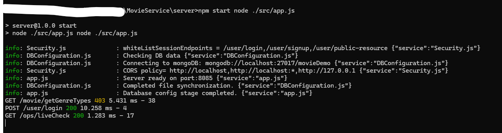
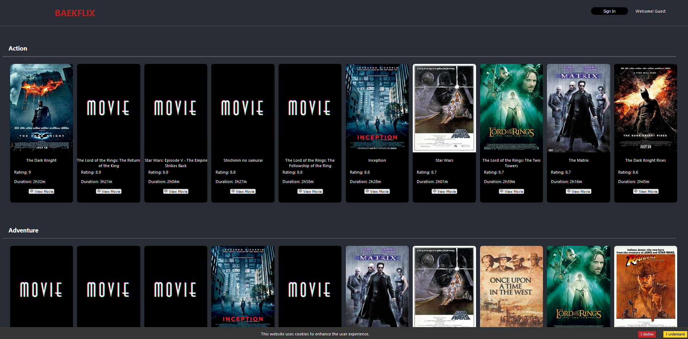
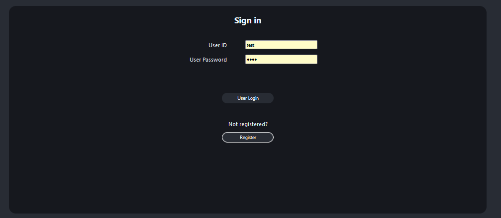
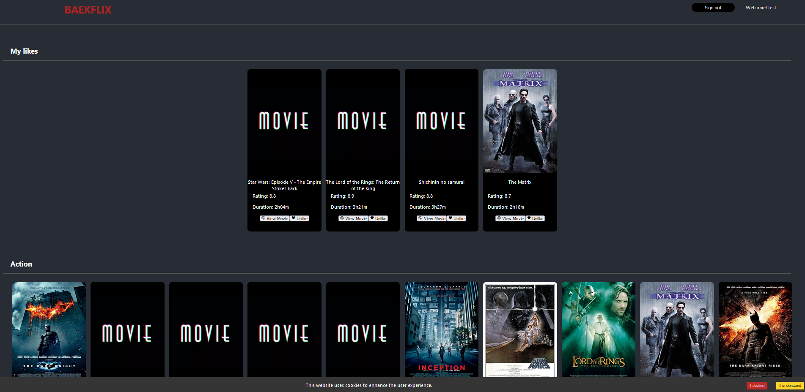
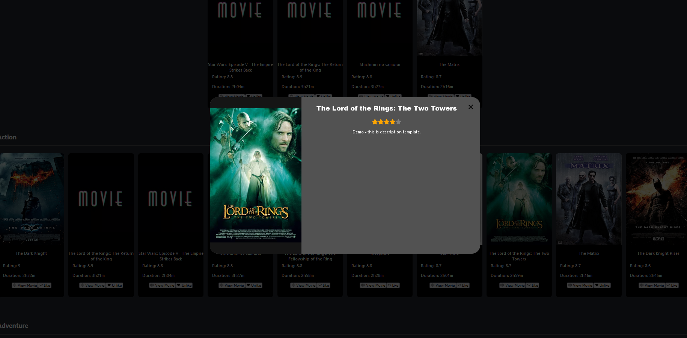

# MovieService
A seperated repo from https://github.com/MarcoBackman/ReactProjects

# How to setup and run (server - backend)

> Make sure to run server application before running beakflix application.<br/>
> server application serves as backend REST API server while beakflix serves as a dynamic frontend application.

1. First, install Node.jS for react application

2. Second, install MongoDB environment locally or configure setup to connect to your mongoDB host.

   [Install mongoDB](https://www.mongodb.com/docs/manual/administration/install-community/)

3. Then setup configuration file.
    - add `config.json` file at the repository root path.
    - fill in every credentials labeled with `{}` in the following json content.
    - when you have authentication setup for mongo db set `"hasAuth" : true` otherwise `"hasAuth" : true`.
    - When you have ssl configured for http communication, set `"cookie" : { "ssl" : false }` to `true`.
   ```json
   {
     "database": {
       "hasAuth" : false,
       "username" : "{YOUR_MONGODB_USERNAME}",
       "password" : "{YOUR_MONGODB_PW}",
       "host" : "{YOUR_MONGODB_HOST}",
       "port": "{YOUR_MONGODB_PORT}",
       "dbname" : "movieDemo"
     },
     "server": {
       "corsWhiteList" : ["http://localhost", "http://localhost:*", "http://127.0.0.1"],
       "port": "{YOUR_DESIRED_EXPRESS_SERVER_PORT}"
     },
     "session": {
       "sessionKey" : "{YOUR_RANDOM_SESSION_KEY}",
       "sessionTime" : 900000,
       "whiteListSession" : [
         "/user/login", "/user/signup", "/user/public-resource",
         "/movie/*",
         "/ops/liveCheck",
         "/security/*"
       ]
     },
     "cookie" : {
       "secret" : "{YOUR_SERVER_COOKIE_KEY}",
       "ssl" : false
     }
   }
   ```

4. Run server with following command under `.\MovieService\server\`
   ``` 
   npm start node ./src/app.js
    ```
   

5. Import postman collection located at `server/postman/React-BeakFlix.postman_collection.json`
   
   Run postman requests or use curl
   


# How to setup and run (baekflix - frontend)

1. Make sure you backend service is running with valid MongoDB connection

2. Navigate to `\MovieService\baekflix\src\` and modify `config.json` for you local server connection.
   For example, if you're running backend server in localhost:8085, you should put host as `localhost` and port as `8085`.
   Additionally, if you have modified server http protocols to have ssl communication, then set `ssl` to `true` (by default, it is false).

3. Make sure to change your proxy target if your server url and port is different. Go to `baekflix/package.json` and change `"proxy": "http://localhost:8085`

4. At path `\MovieService\baekflix\` run following command.
   `npm install` then `npm start`

Then the open following url in your browser

`http://localhost:8084/` 

Then the following page will be shown
>

User login/register to view more features
>

User liked section will be shown based on your added favorites.
>

Click show more to view details.
>

## Things to improve in the future.
- Make sure session works. (Session data has to be stored in database)
- Have retry, circuit breaker mechanism.
- Implement loading icon while contents are loading.
- Email validation steps for register.
- Oauth, 2FK for login.